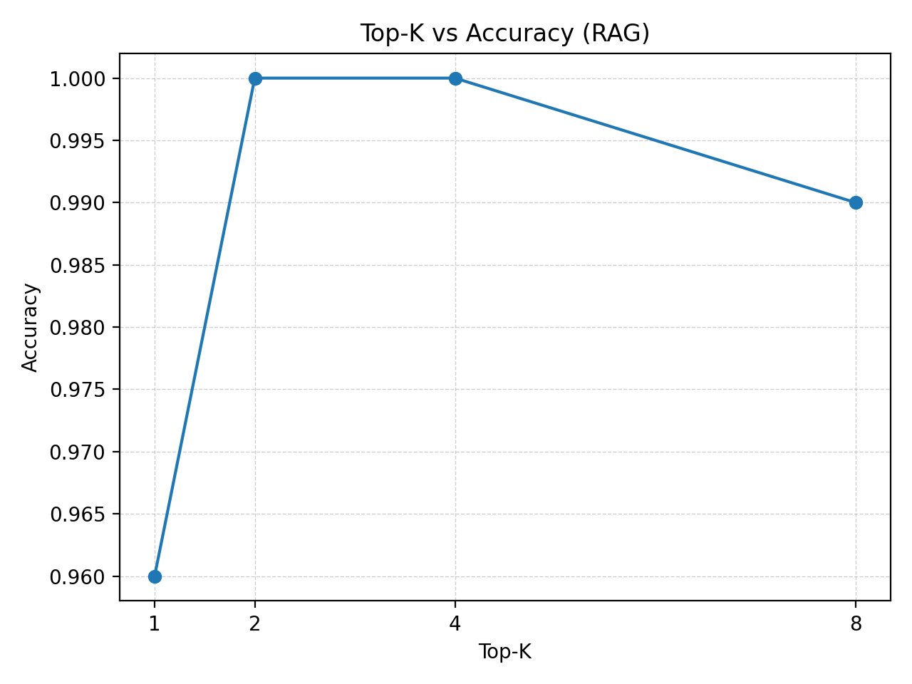
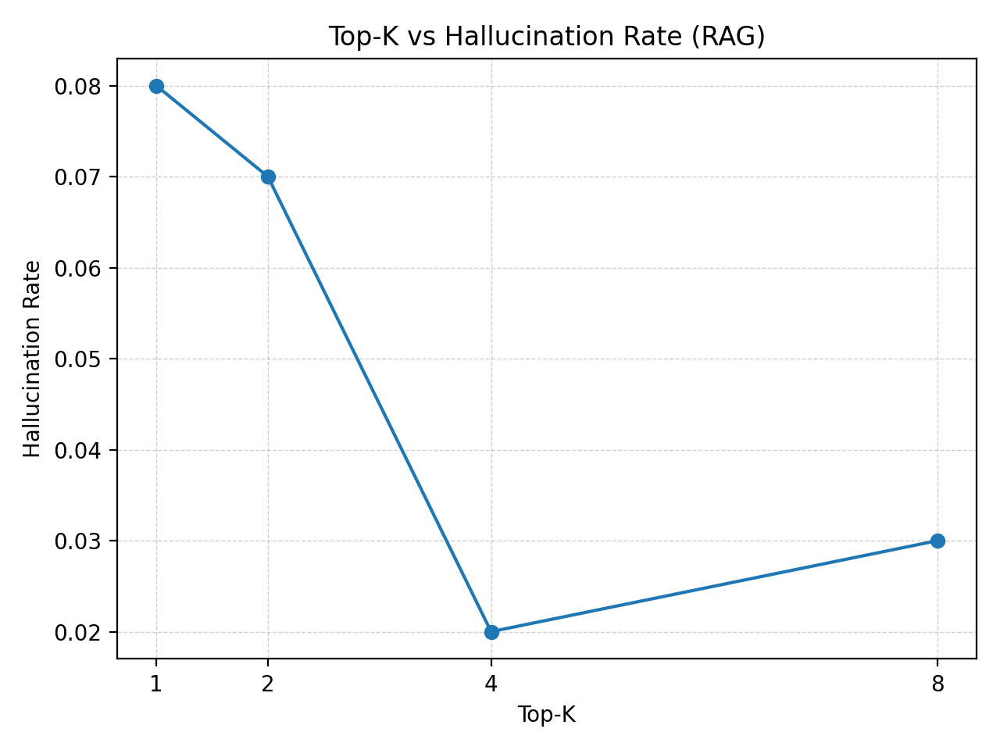

# MedQA-RAG: A Medical QA System Powered by DeepSeek-R1
## 智疗问答：基于DeepSeek-R1的医疗RAG系统
SX2524021-金文伟

## 1. 项目概述

本项目面向“中文领域特定问答系统（Domain-Specific QA）”任务，选择**医疗问答**作为垂直领域，基于公开数据集 **cMedQA2** 构建一个可交互的 RAG（Retrieval-Augmented Generation）系统。系统目标包括：

* 在医疗领域问题上提供更高的回答准确率，并降低幻觉（hallucination）。
* 支持**多轮对话**与**长上下文**（工程化实现为“滚动摘要 + 最近窗口 + RAG 检索”）。
* 在 Web Demo 中提供**引用来源展示**与**不确定拒答**能力（当检索结果不可靠时拒绝武断回答）。

项目包含：向量库构建脚本、评估脚本（Baseline vs RAG）、Streamlit Web Demo、配置文件与可复现运行说明。

---

## 2. 数据来源与处理

### 2.1 数据来源

* 数据集：cMedQA2
  获取地址：`https://github.com/zhangsheng93/cMedQA2`

数据文件包括（核心字段）：

* `question.csv`: `question_id, content`
* `answer.csv`: `ans_id, question_id, content`
* `train_candidates.txt / dev_candidates.txt / test_candidates.txt`：候选对；其中测试集按要求仅使用 `label=1` 的正样本用于评估。

### 2.2 数据清洗与构建策略

本项目采用**QA 对构建知识库**的方式：从训练候选中取 `(question_id, pos_ans_id)`，将 “问题 + 正回答” 拼接为文本文档：

* 文档内容模板：
  `问题：{question}\n\n回答：{pos_answer}`

并为每条文档写入 metadata（至少包含 `question_id` 与 `answer_id`），以便后续在 Demo 中做可追溯来源展示。

---

## 3. 方法设计

### 3.1 系统总体架构

系统采用典型 RAG 流程：

1. **检索（Retrieval）**：对用户问题（或改写后的检索查询）进行向量检索，返回 Top-K 最相关文档片段。
2. **增强（Augmentation）**：将检索结果拼接为 context，与对话摘要/最近对话一起送入大模型。
3. **生成（Generation）**：大模型在“证据约束”提示词下生成回答；资料不足时拒答或提示补充信息。

### 3.2 模型与向量库

* 对话模型（本地 Ollama）：

  * `ollama:deepseek-r1:8b`
  * `temperature=0.1`
* 向量模型（本地 Ollama Embedding）：

  * `qwen3-embedding:4b`
* 向量库：

  * Chroma（持久化目录：`./chroma_rag_db`）

选择本地推理/Embedding 的原因：便于复现、降低外部 API 依赖，并支持离线部署演示。

### 3.3 分块策略（Chunking）

为提高检索质量与上下文连贯性，采用递归分块策略（中文标点优先）：

* `chunk_size=500`
* `chunk_overlap=100`
* separators 优先：`\n\n`, `\n`, `。`, `；`, `，`, ` ` …

### 3.4 多轮对话与长上下文方案（>32k tokens）

直接把完整对话历史无上限塞入模型会导致：

* 超过模型上下文长度（或成本急剧上升）
* 关键事实在长对话中被稀释

因此本项目采用工程化长上下文方案：

* **滚动摘要（summary memory）**：将更早的对话压缩成“事实摘要”（症状、时间线、检查结果、关键约束等）。
* **最近窗口（recent turns）**：保留最近若干轮原文对话，保证语言连贯。
* **RAG 检索增强**：对于具体医学知识和历史 QA 证据，通过检索补充。

该策略能支持“对话长度远超单次模型上下文上限”的持续交互，满足作业对长上下文能力的要求。

### 3.5 引用来源显示

在 Web Demo 中展示检索到的资料条目，并显示：

* answer_id / question_id / chunk_id / score 等元信息
  用户可直接查看本轮回答背后的检索依据，提高可解释性与可审计性。

### 3.6 不确定拒答策略

医疗场景对幻觉较敏感，本项目在 Demo 侧加入检索置信门控（gating）：

* 当 Top-K 最优结果相似度不足（距离超过阈值）时，系统拒绝给出武断结论
* 转而提示“资料不足/需要补充信息/建议就医科室/危险信号”等保守建议

---

## 4. 实验设置

### 4.1 对比方法

* **Baseline**：不使用向量库，直接调用大模型回答测试集问题。
* **RAG**：使用 Chroma 向量库检索 Top-K 文档作为 context，再调用大模型回答。

### 4.2 评估数据与采样

* 测试集来自 `test_candidates.txt`，仅使用 `label=1` 的样本。
* 本次实验采样 `n=100`（用于快速验证与绘制曲线）。

### 4.3 评估指标

* **Accuracy（准确率）**：通过 LLM-as-judge 判断模型回答是否与参考正回答在医学含义上基本一致（不要求逐字匹配）。
* **Hallucination Rate（幻觉率）**：通过 judge 判断回答是否存在明显编造、与证据矛盾、或证据不支持的关键具体事实（如确诊结论、具体剂量等）。

> 备注：作业要求中包含“引用F1”。本项目 Demo 提供了可追溯来源展示，但在本次实验中“引用F1”的数值统计未能稳定反映实际引用命中（实现与数据对齐仍需进一步完善），因此本报告主结果以 Accuracy 与 Hallucination 为主，并在“未来改进方向”中列为重点补齐项。

---

## 5. 实验结果（表格 + 曲线）

### 5.1 Top-K 扫描结果表（n=100）

| method   | top_k | n   | accuracy | hallucination_rate |
| :------- | :---- | :-- | :------- | :----------------- |
| Baseline | -     | 100 | 0.76     | 0.32               |
| RAG      | 1     | 100 | 0.96     | 0.08               |
| RAG      | 2     | 100 | 1.00     | 0.07               |
| RAG      | 4     | 100 | 1.00     | 0.02               |
| RAG      | 8     | 100 | 0.99     | 0.03               |

**结论：**

* 与 Baseline 相比，RAG 显著提升准确率（0.76 → 0.96~1.00），并显著降低幻觉率（0.32 → 0.02~0.08）。
* Top-K 在 2~4 时表现最优且稳定；Top-K=8 时准确率略下降、幻觉率略上升，可能与上下文中噪声/冗余增多有关。

### 5.2 曲线图

请将下列两张图插入报告（图片由 `Top-K 扫描脚本`自动生成）：

* Top-K vs Accuracy（RAG）：
  `./results/topk_accuracy.png`
  

* Top-K vs Hallucination Rate（RAG）：
  `./results/topk_hallucination_rate.png`
  

---

## 6. 问题分析与创新点

### 6.1 为什么 RAG 能显著提升并降低幻觉

Baseline 直接生成时容易出现：

* 缺少事实依据导致编造
* 对专业知识点（病因、用药建议、就医建议）不稳定

RAG 引入检索证据后：

* 模型可围绕检索到的“问题-回答”资料生成更贴近数据分布的回答
* 在证据约束提示词与拒答策略作用下，能明显降低幻觉率

### 6.2 本项目的实现要点（可作为创新/工程亮点）

* **本地可复现 RAG**：使用 Ollama 本地模型与 embedding，减少外部依赖。
* **长上下文工程化**：滚动摘要 + 最近窗口 + RAG 检索，支持持续多轮对话。
* **拒答门控**：在检索不可靠时拒绝武断结论，符合医疗场景安全性需求。
* **可解释来源展示**：Demo 侧展示检索条目与 metadata，便于追踪依据。

---

## 7. Web Demo 截图/链接

* 仓库地址：`https://github.com/jinwenwei123/MedQA-RAG`
* Demo 启动方式：`streamlit run app.py`
* Demo 截图：
  1. 正常回答 + 引用来源展示截图：
  
  2. 触发拒答的截图：
  
---

## 8. 未来改进方向

1. **补齐并稳定引用F1评估**：让模型输出结构化 citations（answer_id 列表）并与 gold 对齐；或实现严格的“引用片段定位”评价，避免数值无意义。
2. **检索策略优化**：尝试 MMR、多路召回（不同 chunk_size/不同 embedding）、或引入 reranker（轻量交叉编码器）提升 Top-K 质量。
3. **拒答策略系统化**：对拒答阈值做系统扫描，权衡 Accuracy 与 Hallucination；加入“先判断证据是否足够再回答”的二阶段流程。
4. **领域微调（可选）**：在算力允许时，对小型 reranker 或 embedding 做对比学习微调，或对 LLM 做轻量 LoRA/SFT 提升医疗问答一致性。

---

## 9. 可复现性说明（运行命令）

1. 创建环境（Python 3.11）：

```bash
conda create -n medqa-rag python=3.11 -y
conda activate medqa-rag
pip install -r requirements.txt
```

2. 构建向量库：

```bash
python build_vector_store.py
```

3. 评估：

```bash
python eval.py
```

4. Top-K 扫描生成表格与曲线（如果你使用了扫描脚本）：

```bash
python topk_scan.py --topks 1,2,4,8 --max_samples 100 --outdir results
```

5. 启动 Demo：

```bash
streamlit run app.py
```
